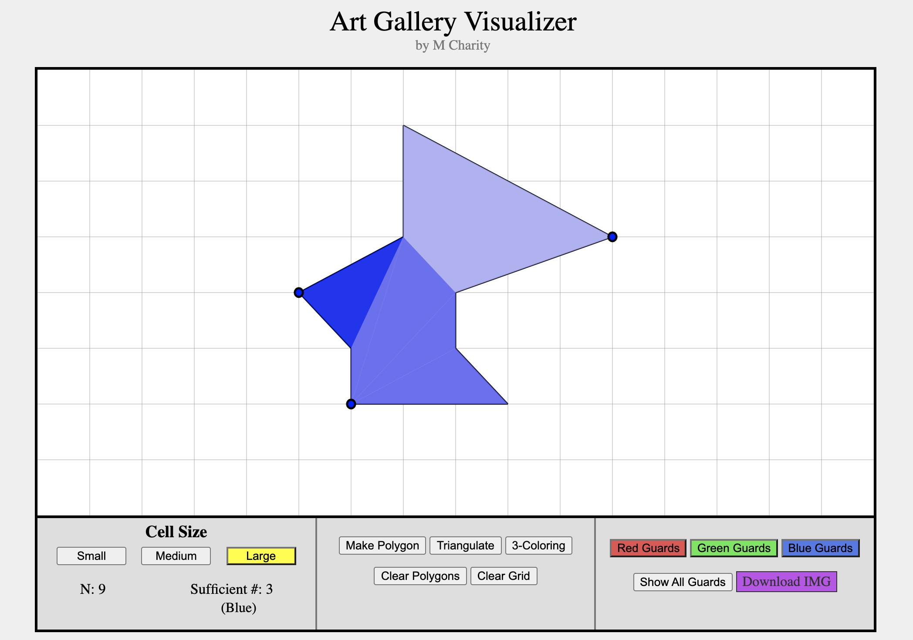
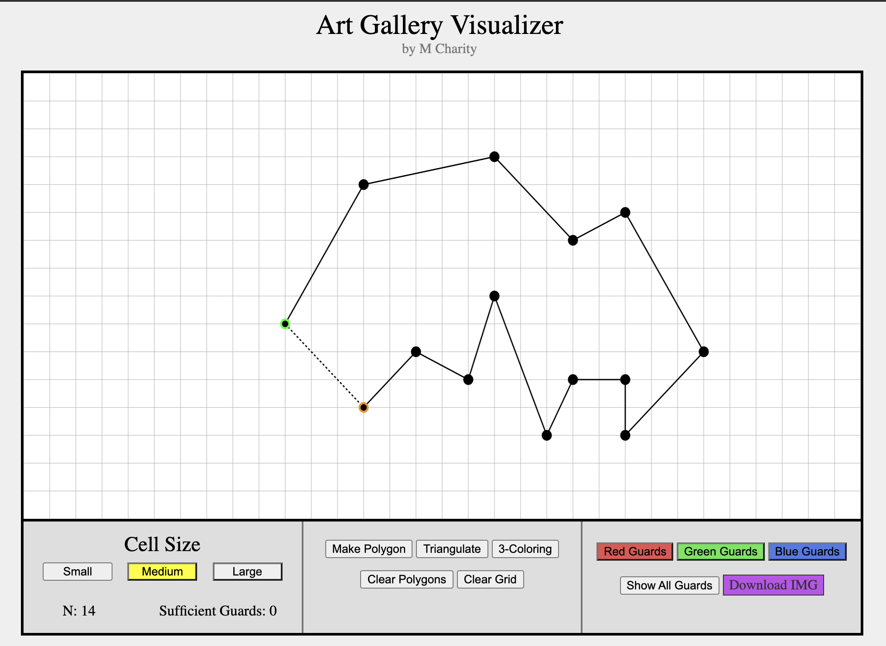
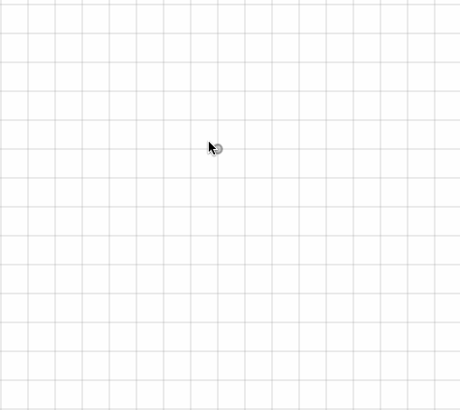
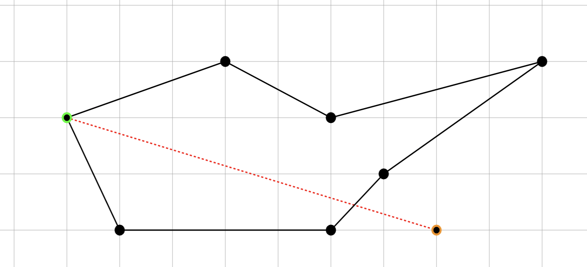
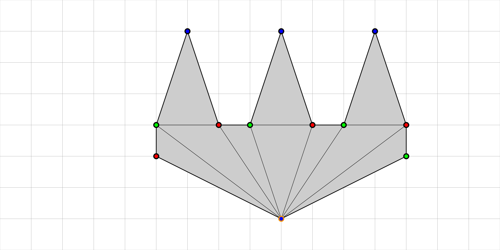
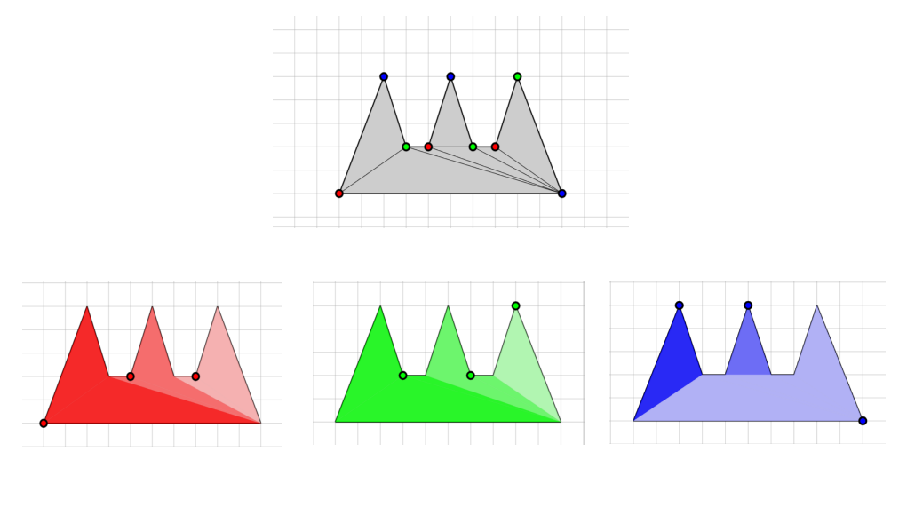

# [Art Gallery Visualization](https://mastermilkx.github.io/art-gallery/)
### M Charity
Computational Geometry 2021 Extended Summer project implementing a interactive web app for the Art Gallery problem. 

## Background
---
### Introduction
The art gallery problem was first posed by Victor Klee and Vasek Chvatal in 1973. It describes a situation of stationing watchmen or cameras (guards) in an art gallery while requiring the minimum number of guards that can observe the entire gallery. Chvatal's inductive proof showed that lower-bound(n/3) guards are always sufficient for coverage of a simple polygon. Steve Fisk later simplified Chvatal's proof to a 3-coloring triangulation.

### Project Description
This project is an interactive application that visualizes Fisk's 3-coloring triangulation proof for the art gallery problem. The core features of this interactive web app includes:
1. Allow the user to place vertices and draw line segments on a contained grid-space to create a simple polygon
2. Display a multiple possibilities of sufficient guard placements (lower-bound(n/3)) on the vertices of the polygon that would show coverage of the polygon based on 3-coloring of the vertices.
3. The ability to save the image of the designed polygon and the guard placements. 

This interactive visualization is a web application written using HTML5, Javascript, and CSS and available online via Github web server hosting. The polygon triangulation is calculated using the [Earcut](https://github.com/mapbox/earcut) JS library. All other aspects of the code are written from scratch using vanilla JS. The backend algorithms and code are located in [src/app.js](src/app.js). The front-end user interface code and styling is located in [src/index.html](src/index.html). 

## Tutorial
### Requirements 
* Web-browser

### Running the code
There are 2 options for running the code:
1. **(Preferred)** Run online on the repo website [https://mastermilkx.github.io/art-gallery/]
2. Download the repository and open the main file [src/index.html](src/index.html) in a browser

### How to Use the App

To create a simple polygon, triangulate it, place the guards, and view possible guard placements, follow these instructions:
1. **Click a point on the grid to place a vertex** - the potential vertex will be colored in a transparent gray before being placed.
2. To connect 2 vertices together via a line segmenet, **click on one of the endpoints** (it will turn green when selected) and the hover over its potential adjacent vertex (the adjacent vertex will turn orange when hovered over). A dotted line will appear in between the vertices. **Click the adjacent vertex to place the line**. 

    [NOTE] The segment will be colored red if the segment cannot be placed between the two vertices. This will occur in the following situations, which would prevent a simple polygon from being formed:
    1. Intersection with another line segment
    2. Intersection with another vertex
    3. Two segments already connected with one of the endpoints
    * 
    *To select the segment, select the two endpoints.*
    
3. **To form a polygon, click the button [Make a Polygon]** in the middle section. A polygon cannot be formed if there are *unconnected vertices, more than one potential polygon on the grid, or only 0-2 vertices on the map*. This will display as an error message in the bottom middle section. 
4. **To triangulate the polygon, click the button [Triangulate]** in the middle section. Clicking the button multiple times will generate different triangulations for the polygon. 
5. **To place guards (perform 3-coloring), click the button [3-Coloring]** in the middle section. The vertices will be colored red, green, or blue on the canvas depending on the triangulation of the polygon. No triangle will have the same 2 colored vertices. 
6. **To change the guards shown, click on the [Red, Green, or Blue Guards] button** in the right section. This will display each "guard's" view area as separately colored polygons. To **show all of the guards and vertices** again, click **[Show All Guards] button** in the right section. 
7. The **number of vertices** is displayed as **N** in the left section. The **number of sufficient guards** is also displayed to the right of it. Once triangulated and 3-colored, the **color(s) of the sufficient guards** will be displayed. 
### Extra features
* The **size of the grid cells** can be changed by clicking the **[Small, Medium, or Large] buttons** in the left section under *Cell Size*. The default is *Large*. 
* The **polygons and triangles can be cleared** by clicking the **[Clear Polygons] button** in the middle section.
* The **entire grid can be cleared** by clicking the **[Clear Grid] button** in the middle section. WARNING: This will erase everything on the map.
* You can **save the canvas drawing** byt clicking the **[Download IMG] button** in the left section. This will save the contents of the grid to a .png file in the location of your choosing.

### Shortcuts
* **[A]** - Connect all vertices in the order they were placed (Warning: Vertices placed out of order will not form polygons)
* **[S]** - Create a line segment between the last two placed vertices
* **[D]/[Backspace]** - Delete a selected vertex or a selected segment. 

## Code Description
---
* **Drawing** - Drawing the vertices, line segments, polygons, and triangles are done using native HTML5 canvas. User input clicks are calculated based on mouse position relative to the grid cells and vertices and line segments are created or selected based on these positions. 
* **Vertices and Segments** - Classes are made for the vertices and segments. Vertices are stored by their X-Y coordinates and compared by them for equivalency. Segments are defined by reference to these vertices (*a* being the top-left most point and *b* being the bottom-right most point and automatically sorted as such.)  The set of vertices and segments are stored in arrays in the order they were created. A *WeakMap* native JS data object stores a hashmap of the vertices and segments stored with the vertex as the key and a list of their connecting segments as values. Additions, deletions, and searches are done by reference to this hashmap.
* **Intersections, collisions, and adjacency** - Intersections of lines or collisions between vertices are calculated using either lookups or through linear algebra to keep validity of the vertices and segments placed and created. 3 adjacent vertices connected in a row delete the middle vertex. Vertices are checked if they are being placed on a line segment to prevent this. Adjacent vertices are found via lookup in the hashmap. 
* **Polygon formation and triangulation** - A polygon is formed iff all vertices are connected, each vertex has exactly 2 line segments, there are at least 3 vertices on the map, no line segments intersect each other, there exists no row of 3 or more vertices, and no stray vertex lies inside or outside of a polygon. Triangulation is performed by the [Earcut](https://github.com/mapbox/earcut) JS library - the only outsourced code in the project. The X-Y coordinates of each vertex in the order they are placed around the polygon are passed to the *"earcut()"* function and indices of the vertices are returned back in sets of 3 - making the triangles for the polygon. Different triangulations can be made based on the starting vertex passed. 
   
* **3-coloring and guard placement** - To perform 3-coloring, a random triangle is selected and colored using the three colors red, green, and blue. Repeating onward, the triangle with the most colored vertices is found and its remaining uncolored vertices are colored until every vertex in the polygon has been colored. This results in a possible 3-coloring of the triangulation where no triangle has 2 or more of same colored vertex. Based on Fisk's proof, the colored polygon can show the set of guards (red, green, or blue) that can view the entire polygon. This viewing area is demonstrated by showing the combined set of connected triangles for each vertex. Based on the triangulation performed by Earcut, there will always exists a coloring of at most (n/3) or less where the guards can sufficiently cover the polygon. 
   
---
#### References and Acknowledgements
[https://wild.maths.org/art-gallery-problem]

[https://plus.maths.org/content/art-gallery-problem]

[https://en.wikipedia.org/wiki/Art_gallery_problem]

Except as described above, all the work on this project is my own. M Charity.

